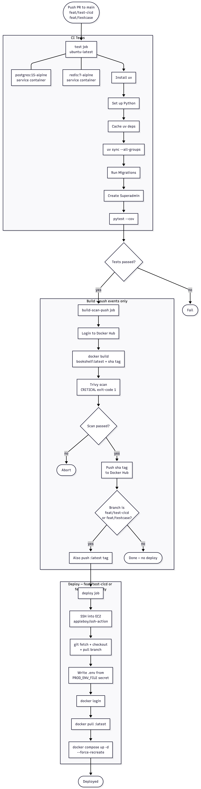

# Deployment Guide

## Overview

BookShelf automated CI/CD pipeline built on GitHub Actions. Every push to `main`, `feat/test-cicd` triggers a test run. On push events, a Docker image is built, scanned for vulnerabilities, and deployed to an AWS EC2 instance.

---

## Pipeline Flow

---

## Pipeline Triggers

Defined in `.github/workflows/ci-cd.yml`:

| Event | Branches | Effect |
|---|---|---|
| `push` | `main`, `feat/test-cicd`, `feat/testcase` | Runs tests + build + deploy |
| `pull_request` | `main`, `feat/test-cicd`, `feat/testcase` | Runs tests only |

!!! note
    The `build-scan-push` and `deploy` jobs are **skipped on pull requests** — only `push` events trigger them.

---

## Job 1 — CI Tests (`test`)

Runs on every push and pull request.

### Service Containers

| Service | Image | Port |
|---|---|---|
| PostgreSQL | `postgres:15-alpine` | `5432` |
| Redis | `redis:7-alpine` | `6379` |

### Environment

The test job injects all required environment variables inline — no `.env` file needed:

| Variable | Value |
|---|---|
| `DATABASE_URL` | Points to the Postgres service container |
| `REDIS_URL` | Points to the Redis service container |
| `CELERY_BROKER_URL` / `CELERY_RESULT_BACKEND` | Redis DB 0 |

### Steps

| # | Step | Detail |
|---|---|---|
| 1 | Checkout | `actions/checkout@v4` |
| 2 | Install uv | `astral-sh/setup-uv@v4` — latest version |
| 3 | Set up Python | `uv python install` — version from `pyproject.toml` |
| 4 | Cache dependencies | Keyed on `uv.lock` hash for fast restores |
| 5 | Install dependencies | `uv sync --all-groups` |
| 6 | Run migrations | `uv run python manage.py migrate --no-input` |
| 7 | Create superadmin | `uv run python manage.py create_superadmin` |
| 8 | Run tests | `uv run pytest --cov=. --cov-report=xml` |

!!! tip
    The `build-scan-push` job only runs if **this job succeeds**. A single test failure blocks the entire pipeline.

---

## Job 2 — Build, Scan & Push (`build-scan-push`)

Runs only on `push` events, after `test` passes.

### Steps

| # | Step | Detail |
|---|---|---|
| 1 | Checkout | `actions/checkout@v4` |
| 2 | Login to DockerHub | `docker/login-action@v3` using `DOCKERHUB_USERNAME` + `DOCKERHUB_TOKEN` secrets |
| 3 | Build image | Tagged as both `:latest` and `:<git-sha>` |
| 4 | Trivy vulnerability scan | Scans the `:<git-sha>` image; exits with code `1` on `CRITICAL` findings |
| 5 | Push | Always pushed if scan passes |

!!! warning "Trivy blocks push"
    If any `CRITICAL` severity CVE is found in the image, the job fails immediately and **no image is pushed to Docker Hub**.

## Job 3 — Deploy (`deploy`)

Runs only when the push is to `feat/test-cicd` or `feat/testcase`, after `build-scan-push` passes.

### Steps

| # | Step | Detail |
|---|---|---|
| 1 | SSH into EC2 | `appleboy/ssh-action@v0.1.7` using `EC2_HOST`, `EC2_USERNAME`, `EC2_SSH_KEY` secrets |
| 2 | Pull latest code | `git fetch` + `git checkout` + `git pull` for the current branch |
| 3 | Write `.env` | Overwrites `/home/ubuntu/django-app/.env` from `PROD_ENV_FILE` secret |
| 4 | Docker login | Authenticates to Docker Hub on the EC2 host |
| 5 | Pull image | Pulls `bookshelf:latest` from Docker Hub |
| 6 | Restart stack | `docker compose up -d --force-recreate` |

!!! info
    `--force-recreate` ensures all containers are restarted with the latest image, even if the Compose config hasn't changed.

---

## Required GitHub Secrets

| Secret | Used In | Purpose |
|---|---|---|
| `DOCKERHUB_USERNAME` | Build + Deploy | Docker Hub login |
| `DOCKERHUB_TOKEN` | Build + Deploy | Docker Hub authentication token |
| `EC2_HOST` | Deploy | Public IP or hostname of EC2 instance |
| `EC2_USERNAME` | Deploy | SSH user (e.g., `ubuntu`) |
| `EC2_SSH_KEY` | Deploy | Private SSH key for EC2 access |
| `PROD_ENV_FILE` | Deploy | Full contents of production `.env` file |

---

## Tools Used

| Tool | Purpose |
|---|---|
| **GitHub Actions** | CI/CD automation platform |
| **uv** | Fast Python package and project manager |
| **pytest + coverage** | Test runner with XML coverage reports |
| **Docker** | Application containerization |
| **Docker Hub** | Container image registry |
| **Trivy** | Container image vulnerability scanner |
| **appleboy/ssh-action** | SSH into EC2 for remote deployment |
| **Docker Compose** | Multi-container orchestration on EC2 |