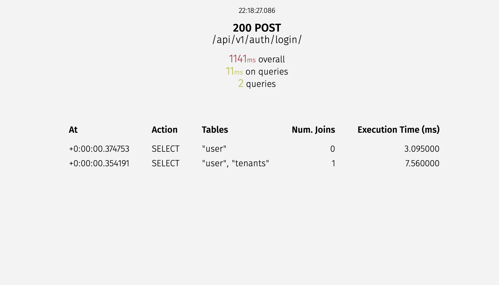
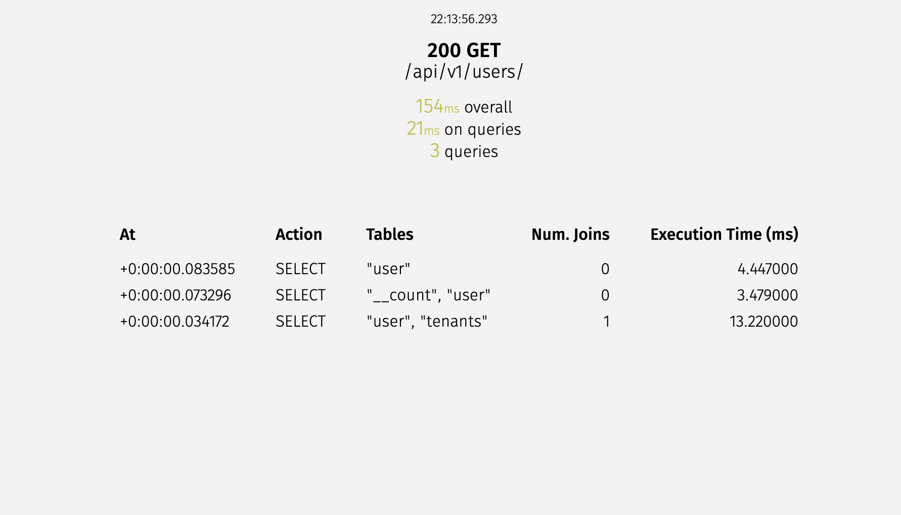
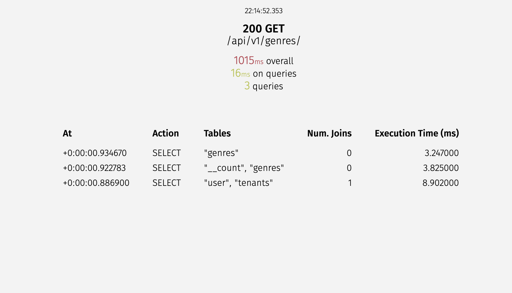
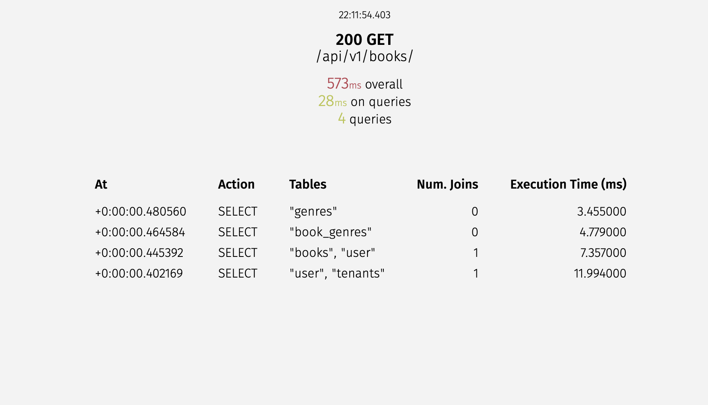
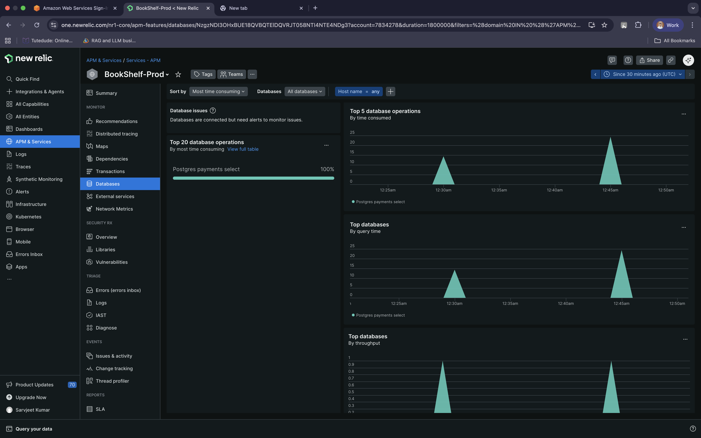
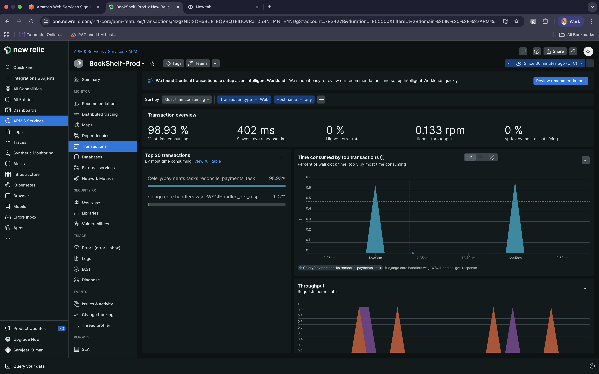

---
hide:
  - toc
---
# Optimization

## Tools

- **django-silk**: A live profiling tool. 
 Identifying inefficient SQL queries and N+1 query problems across the API.

- **pyinstrument**: A call stack profiler. Pinpointing the exact line of Python code causing bottlenecks in complex business logic (e.g., token generation or complex serialization).

- **New Relic**: Production monitoring.Real-time APM and error tracking in a live environment, also provides profiling.

- **Locust**: Load testing.Simulating concurrent users to find breaking points, assess system stability, and monitor application health under scale.

## Query Optimization Best Practices

1. **Select Related**: Use `select_related` for foreign key and one-to-one relationships (joins at the SQL level).
2. **Prefetch Related**: Use `prefetch_related` for many-to-many and reverse-foreign key relationships (separate queries, joined in Python).
3. Retrieve only necessary fields to reduce database load and memory usage.

## Optimization Techniques

We implement several layers of optimization across the stack:

- **Database Indexing**: Ensuring UUID paths, usernames, emails, and frequently queried fields (like tenant association) are fully indexed.
- **Query Optimization**: Extensive usage of `select_related('tenant')` during JWT authentication and `prefetch_related('book_genres__genre')` when listing books to solve N+1 structural problems.
- **Redis Cache**: Performance boost for high-traffic catalog data, such as standard book listings and global queries.
- **Background Processing**: Offloading heavy synchronous tasks (like Email Verification OTPs and Razorpay reconciliation) to **Celery** workers.

## Load Testing with Locust

Run load tests to simulate user traffic against your BookShelf APIs:

```bash
uv run locust -f tests/performance/locustfile.py
```

## Reports

### Locust Load Testing 

**Users - 100**
<iframe src="../assets/locust.html" width="100%" height="1000px"></iframe>

### Pyinstrument

**Login API**
<iframe src="../assets/pyinstrument_api_v1_auth_login.html" width="100%" height="500px"></iframe>

**User Books API**
<iframe src="../assets/pyinstrument_api_v1_books.html" width="100%" height="500px"></iframe>

### Django Silk







## New Relic 





